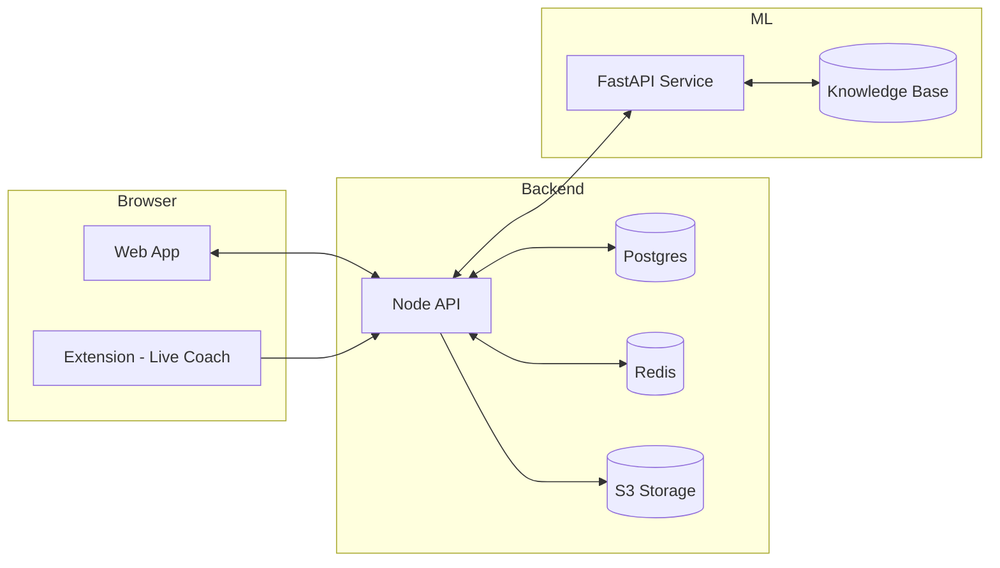

# 🛡️ AI Guardian — The Smart Safety Net for Kids in the Age of AI

> **Protect. Guide. Empower.**  
> **AI Guardian** is a values-aligned companion that analyzes the **safety**, **learning quality**, and **bias** of AI-powered content (videos, chatbots, apps) kids use. It gives parents and educators **plain-English explanations**, **actionable nudges**, and a **calm, modern dashboard**—without creepy surveillance.

## 🎯 North Star

Keep kids safe, curious, and thriving with AI—without surveillance and with parental transparency & control.

---

## 🚀 Quick Start (10 minutes to demo)

```bash
# Clone and setup
git clone https://github.com/KinshukON/AI-Guardian.git
cd AI-Guardian
pnpm install

# Start all services
pnpm dev

# In another terminal, seed the database (optional)
pnpm seed
```

Visit `http://localhost:3000` to see the demo!

**Demo Credentials:** `parent@example.com` / `demo123`

---

## 🎭 Demo Script (5 minutes)

1. **Toggle Kid Profile**: Switch between age bands (8-10, 11-13, 14-16) with different values
2. **Analyze Content**: Paste a YouTube link → see live Safety/Quality/Bias scores with evidence
3. **Teach Balance**: Hit "Teach Balance" → get dual-sided summary with citations
4. **Ask KidGPT**: Ask a homework question → safe, cited response + "explain like I'm 12" toggle
5. **Dashboard**: Open Guardian Dashboard → digest + quick actions → Generate Weekly Report

---

## ✨ Core Capabilities

### **Content Safety Analyzer**  
Flags violence, bullying, sexual content, scams, and self-harm. Shows *why* with evidence snippets and confidence scores.

### **Learning Quality Scorer**  
Rates factuality, clarity, cognitive depth, and curriculum alignment proxies. Suggests better prompts for deeper learning.

### **Bias & Framing Detector**  
Surfaces stereotypes, framing polarity, and missing perspectives. One-tap **Balanced View** generates dual-perspective summaries.

### **Guardian Dashboard**  
Daily digest, wellbeing insights, trends, and quick actions (timeouts, nudges, whitelist/graylist).

### **KidGPT (Values-Aligned Mentor)**  
Cited, age-appropriate answers with "Explain like I'm 12." Includes safe refusals and escalation guidance.

### **Weekly Reports**  
Parent summary and educator pack (PDF + web) with sources, alerts, and conversation starters.

### **Privacy First**  
No keystroke logging. Data minimization, consent ledger, retention controls, export/delete, and full audit logs.

---

## 🏗️ Architecture



**Current Implementation:**
- **React Web App** (Port 3000) - Full dashboard with authentication
- **Node.js API** (Port 8000) - Fastify backend with mock data
- **Python ML Service** (Port 8001) - FastAPI service for content analysis
- **PostgreSQL** - Database with Prisma ORM
- **Redis** - Caching and queues
- **S3-compatible Storage** - Report storage (MinIO for local dev)

---

## 🛠 Tech Stack

### **Frontend**
- **React 19** with TypeScript
- **TailwindCSS** with custom design system
- **Radix UI** components
- **TanStack Router/Query** for routing and data fetching
- **Framer Motion** for animations
- **Recharts** for data visualization

### **Backend**
- **Node.js** with Fastify framework
- **TypeScript** throughout
- **Zod** for validation
- **OpenAPI 3.1** specification
- **Prisma ORM** for database operations

### **ML Service**
- **Python FastAPI**
- **scikit-learn** for machine learning
- **transformers** for NLP
- **SHAP/fairlearn** for explainability and bias detection
- **pandas** and **numpy** for data processing
- **ONNX Runtime** for model serving

### **Infrastructure**
- **Docker Compose** for local development
- **Terraform** + **Helm** for AWS EKS production deployment
- **GitHub Actions** for CI/CD
- **OpenTelemetry** for observability
- **Grafana** + **Loki** for monitoring

### **Security & Privacy**
- **OIDC** (Auth0/Cognito) for authentication
- **TOTP MFA** and **Passkeys** support
- **Row-level security** in PostgreSQL
- **COPPA/FERPA** aware architecture
- **Privacy by design** principles

---

## 📂 Project Structure

```
AIGuardian/
├── apps/
│   ├── web/                   # React frontend (Dashboard + KidGPT UI)
│   │   ├── src/
│   │   │   ├── components/    # Layout, navigation
│   │   │   ├── pages/         # Dashboard, Analyzer, KidGPT, Reports, Settings
│   │   │   ├── contexts/      # Authentication context
│   │   │   └── tests/         # Playwright e2e tests
│   │   └── vite.config.ts     # Vite configuration
│   ├── api/                   # Node.js backend (Fastify)
│   │   ├── src/
│   │   │   ├── routes/        # API endpoints
│   │   │   ├── services/      # Business logic
│   │   │   ├── middleware/    # Auth, validation, error handling
│   │   │   └── schemas/       # Zod validation schemas
│   │   └── prisma/            # Database schema and migrations
│   └── ml/                    # Python ML service (FastAPI)
│       ├── main.py            # FastAPI application
│       └── requirements.txt   # Python dependencies
├── packages/
│   ├── ui/                    # Shared React UI primitives
│   │   ├── src/components/    # Button, Card, Badge, ScoreRing
│   │   └── src/lib/           # Utility functions
│   └── config/                # Shared configuration
│       ├── tailwind.config.js # Tailwind CSS configuration
│       ├── tsconfig.json      # TypeScript configuration
│       └── eslint.config.js   # ESLint rules
├── .github/workflows/          # CI/CD pipelines
├── infra/                      # Infrastructure as Code
├── docs/                       # Documentation
├── docker-compose.yml          # Local development environment
├── pnpm-workspace.yaml         # Monorepo configuration
└── package.json                # Root package configuration
```

---

## 🎨 Design System

### **Color Palette**
- **Primary**: Deep Navy (#0F172A) - Trust and authority
- **Accent**: Azure Blue (#2563EB) - Interactive elements
- **Success**: Spring Mint (#A7F3D0) - Positive feedback
- **Warning**: Amber (#F59E0B) - Caution and alerts
- **Error**: Rose (#E11D48) - Critical issues
- **Neutral**: Sand (#F1F5F9) - Backgrounds and borders

### **Typography**
- **UI Font**: Inter - Clean, modern interface text
- **Explanation Font**: Source Serif Pro - Readable long-form content
- **Code Font**: JetBrains Mono - Technical content

### **Component Principles**
- **Rounded-2xl** cards for soft, approachable feel
- **Soft shadows** for depth without heaviness
- **8px grid system** for consistent spacing
- **Gentle animations** for feedback and delight

---

## 🔒 Privacy & Security

### **Privacy by Design**
- **Data minimization** - Only collect what's necessary
- **Consent-led processing** - Clear opt-in mechanisms
- **Retention controls** - Configurable data lifecycle
- **Export/delete rights** - Full user control over data
- **Audit logging** - Transparent data usage tracking

### **Security Features**
- **Row-level security** - Parents only access their child's data
- **TLS encryption** - All data in transit encrypted
- **AES-256 encryption** - Data at rest protection
- **Security headers** - XSS, CSRF, and injection protection
- **WAF integration** - Web application firewall
- **SBOM generation** - Software bill of materials

### **Compliance**
- **COPPA aware** - Children's Online Privacy Protection Act
- **FERPA ready** - Family Educational Rights and Privacy Act
- **GDPR compliant** - General Data Protection Regulation
- **SOC 2 Type II** - Security and availability controls

---

## 🧪 Testing & Quality

### **Testing Strategy**
```bash
# Run all tests
pnpm test

# E2E tests with Playwright
pnpm test:e2e

# Type checking
pnpm typecheck

# Linting
pnpm lint
```

### **Test Coverage**
- **Unit Tests**: Vitest for component and service testing
- **Integration Tests**: API endpoint testing
- **E2E Tests**: Playwright for user journey validation
- **Performance Tests**: Lighthouse CI integration
- **Accessibility Tests**: WCAG 2.2 AA compliance

### **Quality Gates**
- **Test Coverage**: ≥80%
- **Lighthouse Score**: ≥95 (PWA, a11y, best practices)
- **Type Coverage**: 100% TypeScript coverage
- **Performance**: LCP <2.0s, TTI <3.0s (mid-tier mobile)

---

## 🚧 Development

### **Local Development**
```bash
# Start all services
pnpm dev

# Start specific services
pnpm --filter web dev          # React app only
pnpm --filter api dev          # Node API only
pnpm --filter ml dev           # ML service only

# Database operations
pnpm db:reset                  # Reset database
pnpm seed                      # Seed with sample data

# Docker operations
pnpm docker:up                 # Start all services
pnpm docker:down               # Stop all services
```

### **Environment Setup**
```bash
# Copy environment template
cp env.example .env

# Configure your environment variables
# See env.example for required values
```

### **Code Quality**
```bash
# Format code
pnpm format

# Lint code
pnpm lint

# Type check
pnpm typecheck

# Build all packages
pnpm build
```

---

## 📊 Performance Targets

### **Core Web Vitals**
- **LCP (Largest Contentful Paint)**: <2.0s
- **FID (First Input Delay)**: <100ms
- **CLS (Cumulative Layout Shift)**: <0.1
- **TTI (Time to Interactive)**: <3.0s

### **Lighthouse Scores**
- **Performance**: ≥95
- **Accessibility**: ≥95
- **Best Practices**: ≥95
- **SEO**: ≥95
- **PWA**: ≥95

### **API Performance**
- **Response Time**: <200ms (95th percentile)
- **Throughput**: 1000+ requests/second
- **Availability**: 99.9% uptime

---

## 🔮 Roadmap

### **v1.0 (Current)**
- ✅ **Digital Wellbeing Coach** - Content analysis and safety scoring
- ✅ **KidGPT** - Values-aligned AI mentor
- ✅ **School Portal** - Educator dashboard and reports
- ✅ **Parent Dashboard** - Daily digest and quick actions

### **v2.0 (Q2 2025)**
- 🚧 **Mobile App** - iOS and Android applications
- 🚧 **Screen Time Agreements** - Digital contract system
- 🚧 **Advanced Analytics** - Learning pattern recognition
- 🚧 **Integration APIs** - Third-party platform connections

### **v3.0 (Q4 2025)**
- 📋 **Community Patterns** - Shared safety configurations
- 📋 **Federation Support** - Multi-tenant deployments
- 📋 **SSO Integration** - Enterprise authentication
- 📋 **AI Model Marketplace** - Custom safety models

---

## 🤝 Contributing

We welcome contributions from the community! Here's how to get started:

### **Development Setup**
1. Fork the repository
2. Clone your fork: `git clone https://github.com/YOUR_USERNAME/AI-Guardian.git`
3. Install dependencies: `pnpm install`
4. Create a feature branch: `git checkout -b feature/amazing-feature`
5. Make your changes and test: `pnpm test`
6. Commit with conventional commits: `git commit -m "feat: add amazing feature"`
7. Push to your fork: `git push origin feature/amazing-feature`
8. Open a pull request

### **Contribution Guidelines**
- **Code Style**: Follow the existing TypeScript and React patterns
- **Testing**: Add tests for new features and ensure all tests pass
- **Documentation**: Update README and add JSDoc comments
- **Conventional Commits**: Use semantic commit messages
- **Pull Request**: Provide clear description and link related issues

### **Areas for Contribution**
- **UI/UX Improvements** - Better accessibility, responsive design
- **ML Models** - Enhanced safety detection algorithms
- **Testing** - Additional test coverage and scenarios
- **Documentation** - API docs, user guides, tutorials
- **Performance** - Optimization and monitoring improvements

---

## 📚 Documentation

- **🏠 [Home](https://github.com/KinshukON/AI-Guardian/wiki)** - Project overview and mission
- **🚀 [Getting Started](https://github.com/KinshukON/AI-Guardian/wiki/Getting-Started)** - Setup and first steps
- **📦 [Components](https://github.com/KinshukON/AI-Guardian/wiki/Components)** - UI component library
- **✨ [Features](https://github.com/KinshukON/AI-Guardian/wiki/Features)** - Detailed feature descriptions
- **🏗️ [Architecture](https://github.com/KinshukON/AI-Guardian/wiki/Architecture)** - System design and architecture
- **📡 [API Documentation](https://github.com/KinshukON/AI-Guardian/wiki/API-Documentation)** - REST API reference
- **🔐 [Privacy & Ethics](https://github.com/KinshukON/AI-Guardian/wiki/Privacy-&-Ethics)** - Privacy principles and compliance
- **🧭 [Roadmap](https://github.com/KinshukON/AI-Guardian/wiki/Roadmap)** - Future development plans
- **🤝 [Contributing](https://github.com/KinshukON/AI-Guardian/wiki/Contributing)** - How to contribute
- **❓ [FAQ](https://github.com/KinshukON/AI-Guardian/wiki/FAQ)** - Frequently asked questions
- **🤖 [KidGPT](https://github.com/KinshukON/AI-Guardian/wiki/KidGPT)** - AI mentor system details

---

## 📄 License

This project is licensed under the MIT License - see the [LICENSE](LICENSE) file for details.

---

## 🆘 Support

### **Getting Help**
- **GitHub Issues**: [Open an issue](https://github.com/KinshukON/AI-Guardian/issues) for bugs or feature requests
- **Discussions**: [Join the conversation](https://github.com/KinshukON/AI-Guardian/discussions) for questions and ideas
- **Wiki**: Check the [comprehensive documentation](https://github.com/KinshukON/AI-Guardian/wiki)

### **Community**
- **Contributors**: See [contributors](https://github.com/KinshukON/AI-Guardian/graphs/contributors)
- **Code of Conduct**: We're committed to providing a welcoming and inspiring community
- **Security**: Report security issues to [security@aiguardian.org](mailto:security@aiguardian.org)

---

## ⚠️ Disclaimer

AI Guardian is designed to assist parents and educators in making informed decisions about AI content for children. While we strive for accuracy and safety, the platform should not replace parental supervision or professional judgment. Always review content and make decisions appropriate for your child's age and development level.

---

**Built with ❤️ for the next generation of digital citizens**

*AI Guardian - Protecting kids in the age of AI, one analysis at a time.* 🛡️✨
