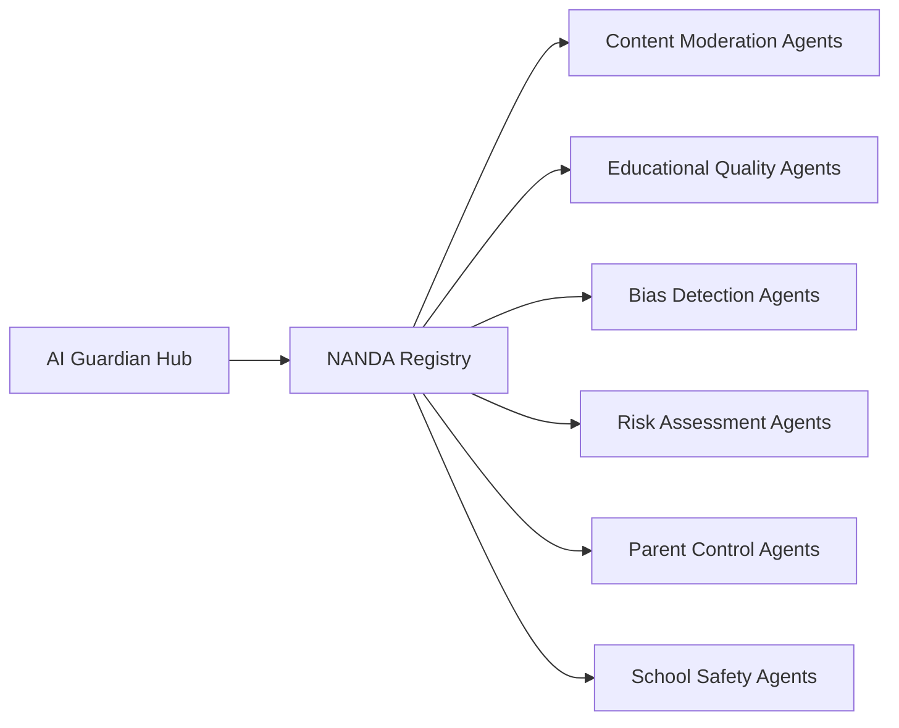
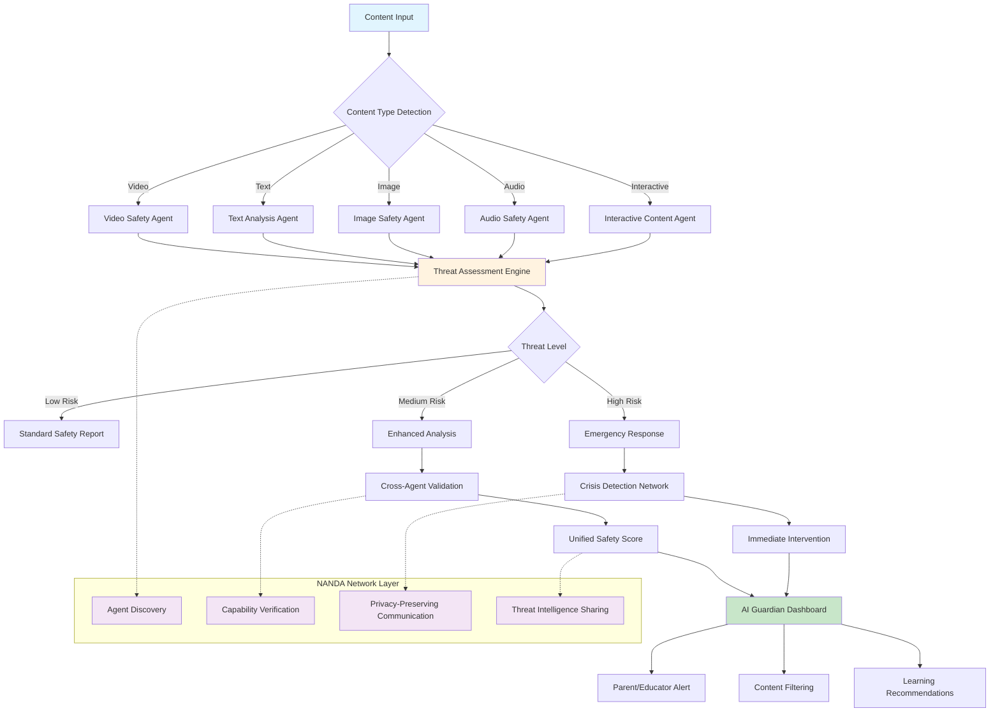

# 🚀 Project NANDA Integration Roadmap
## AI Guardian Future Enhancement & Release Notes

> **Building the AI Safety Network of the Future**  
> This document outlines our strategic integration with Project NANDA to transform AI Guardian into a federated AI safety ecosystem.

---

## 📋 **Document Version History**

| Version | Date | Author | Changes |
|---------|------|--------|---------|
| 1.0.0 | 2025-01-27 | AI Assistant | Initial roadmap creation |
| | | | Project NANDA integration planning |
| | | | Technical implementation phases |

---

## 🎯 **Executive Summary**

**Project NANDA** is building the foundational infrastructure for the **Open Agentic Web** - a system where AI agents can collaborate, communicate, and transact across the internet securely. By integrating AI Guardian with this ecosystem, we can:

- Transform from a standalone safety tool to a **networked safety hub**
- Enable **real-time collaboration** with other AI safety agents
- Build **enterprise-scale** AI safety ecosystems
- Establish **industry standards** for AI safety and child protection

---

## 🔗 **Project NANDA Overview**

### **What is Project NANDA?**
- **Mission**: Building the foundational infrastructure for the Open Agentic Web
- **Core Problem**: Traditional DNS/web infrastructure isn't designed for AI agent systems
- **Solution**: Purpose-built registry architecture for agent discovery and communication

### **Key Components**
- **NANDA Index**: Privacy-preserving agent registry
- **AgentFacts Schema**: Structured agent profiles with cryptographic verification
- **Adaptive Resolution**: Dynamic endpoint resolution for agent communication
- **Zero Trust Agentic Access (ZTAA)**: Enterprise-grade security framework

### **Research Foundation**
- Multiple papers published on arXiv covering registry architecture, DNS limitations, and enterprise implementation
- Backed by industry leaders including Google A2A, TCS, Mitsubishi Electric, HCLTech
- MIT Media Lab research initiative

---

## 🚀 **Strategic Integration Opportunities**

### **1. AI Agent Registry & Discovery**
Transform AI Guardian into a **registered AI agent** in the NANDA ecosystem.

**Benefits:**
- Discoverable by other educational AI systems
- Integration with parent monitoring tools
- School district AI safety platform connectivity
- Content moderation service collaboration

**Agent Capabilities to Register:**
- Content safety analysis
- Bias detection and mitigation
- Risk assessment and prediction
- Educational content validation
- Emotional state monitoring
- Crisis detection and intervention

### **2. Multi-Agent Collaboration Network**
Leverage NANDA's agent-to-agent communication for **federated AI safety**.

**Collaboration Partners:**
- Content moderation agents (YouTube, TikTok, educational apps)
- Educational content providers and platforms
- Parent control and monitoring systems
- School district AI safety platforms
- Government child protection agencies

**Network Architecture:**


### **3. Enhanced Content Analysis Pipeline**
Use NANDA's adaptive resolution for dynamic content routing and analysis.

**Pipeline Benefits:**
- Real-time threat detection across the network
- Specialized analysis by domain experts
- Coordinated response to emerging threats
- Shared intelligence and threat patterns

**Enhanced Content Analysis Pipeline Visualization:**


**Pipeline Components:**
1. **Content Type Detection**: Automatically identifies content format
2. **Specialized Agents**: Route to domain-specific safety analyzers
3. **Threat Assessment**: Multi-dimensional risk evaluation
4. **Cross-Agent Validation**: Network-wide safety consensus
5. **Crisis Response**: Immediate intervention for high-risk content
6. **Unified Reporting**: Single dashboard with comprehensive insights

### **4. Enterprise AI Safety Ecosystem**
Position AI Guardian as the **central hub** for enterprise AI safety using NANDA's ZTAA framework.

**Target Markets:**
- **School Districts**: Multi-school AI safety deployment
- **Content Platforms**: YouTube, TikTok, educational app integration
- **Parent Networks**: Coordinated family safety across devices
- **Government Agencies**: Child protection and education oversight

---

## 🛠️ **Technical Implementation Roadmap**

### **Phase 1: Foundation & Agent Registration** 
**Timeline: Q1 2025**  
**Status: 🚧 Planned**

#### **1.1 NANDA SDK Integration**
- [ ] Install and configure NANDA SDK
- [ ] Implement agent deployment automation
- [ ] Configure DNS, SSL certificates, and systemd services
- [ ] Test agent registration and discovery

#### **1.2 AgentFacts Schema Definition**
- [ ] Define AI Guardian's capabilities in AgentFacts format
- [ ] Implement cryptographic verification of agent identity
- [ ] Create structured agent profile with metadata
- [ ] Test agent discovery and capability verification

#### **1.3 NANDA Index Registration**
- [ ] Register AI Guardian in the NANDA registry
- [ ] Verify agent discoverability across the network
- [ ] Test endpoint resolution and communication
- [ ] Document agent identity and public endpoints

**Deliverables:**
- AI Guardian registered as NANDA agent
- AgentFacts profile with verified capabilities
- Network discovery and communication working

---

### **Phase 2: Agent Communication & Discovery**
**Timeline: Q2 2025**  
**Status: 🚧 Planned**

#### **2.1 NANDA Protocol Implementation**
- [ ] Add NANDA client libraries to ML services
- [ ] Implement agent-to-agent communication protocols
- [ ] Enable dynamic service discovery
- [ ] Test cross-agent data exchange

#### **2.2 Safety Network Integration**
- [ ] Identify and connect with other safety agents
- [ ] Implement cross-agent safety data sharing
- [ ] Build unified safety scoring protocols
- [ ] Test coordinated threat response

#### **2.3 Privacy-Preserving Communication**
- [ ] Implement least-disclosure query protocols
- [ ] Configure data sharing permissions and controls
- [ ] Test privacy-preserving collaboration
- [ ] Document data governance policies

**Deliverables:**
- Multi-agent communication working
- Cross-agent safety data sharing
- Privacy-preserving collaboration protocols

---

### **Phase 3: Federated Safety Network**
**Timeline: Q3 2025**  
**Status: 🚧 Planned**

#### **3.1 Specialized Safety Agents**
- [ ] Create content moderation agent
- [ ] Deploy bias detection agent
- [ ] Implement risk assessment agent
- [ ] Build educational quality agent

#### **3.2 Agent Orchestration Framework**
- [ ] Implement agent coordination and routing
- [ ] Build unified safety scoring algorithms
- [ ] Create automated threat response workflows
- [ ] Test end-to-end safety analysis pipeline

#### **3.3 Network Intelligence & Learning**
- [ ] Implement shared threat intelligence
- [ ] Build pattern recognition across agents
- [ ] Create automated learning and improvement
- [ ] Test network-wide safety improvements

**Deliverables:**
- Specialized safety agent network
- Coordinated safety analysis pipeline
- Network-wide intelligence and learning

---

### **Phase 4: Enterprise Deployment & Scale**
**Timeline: Q4 2025**  
**Status: 🚧 Planned**

#### **4.1 Zero Trust Agentic Access (ZTAA)**
- [ ] Implement enterprise-grade security controls
- [ ] Configure multi-tenant access management
- [ ] Build audit and compliance frameworks
- [ ] Test enterprise security requirements

#### **4.2 School District Deployment**
- [ ] Multi-school AI Guardian deployment
- [ ] Centralized policy management
- [ ] Cross-district safety insights
- [ ] Integration with existing school systems

#### **4.3 Content Platform Integration**
- [ ] YouTube safety integration
- [ ] TikTok content moderation
- [ ] Educational app safety validation
- [ ] Cross-platform safety coordination

**Deliverables:**
- Enterprise-grade security framework
- Multi-school deployment capability
- Content platform integrations

---

## 🎯 **Specific Use Cases & Implementation**

### **1. Real-Time Content Safety Network**
**Goal**: Transform AI Guardian into a **safety hub** that other agents can query.

**Implementation:**
```python
# Example: AI Guardian as Safety Hub
class AIGuardianSafetyHub:
    def __init__(self):
        self.nanda_client = NANDAClient()
        self.safety_agents = self.discover_safety_agents()
    
    def analyze_content(self, content_url):
        # Route to specialized agents
        safety_score = self.route_to_safety_agent(content_url)
        bias_score = self.route_to_bias_agent(content_url)
        risk_score = self.route_to_risk_agent(content_url)
        
        return UnifiedSafetyReport(safety_score, bias_score, risk_score)
```

**Benefits:**
- Dynamic discovery of specialized safety services
- Coordinated response to emerging threats
- Network-wide safety intelligence

### **2. Educational Content Validation**
**Goal**: Collaborate with educational content providers for comprehensive safety assessment.

**Implementation:**
```python
# Example: Educational Content Validation
class EducationalContentValidator:
    def validate_content(self, content):
        # Query multiple validation agents
        safety_agents = self.nanda_client.discover_agents("content_safety")
        quality_agents = self.nanda_client.discover_agents("educational_quality")
        
        # Aggregate validation results
        safety_score = self.aggregate_safety_scores(safety_agents, content)
        quality_score = self.aggregate_quality_scores(quality_agents, content)
        
        return ContentValidationReport(safety_score, quality_score)
```

**Benefits:**
- Comprehensive content validation
- Shared safety assessments across network
- Reputation systems for content creators

### **3. Parent Control Integration**
**Goal**: Coordinate AI Guardian agents across family devices and households.

**Implementation:**
```python
# Example: Family Safety Coordination
class FamilySafetyCoordinator:
    def __init__(self, family_id):
        self.family_agents = self.discover_family_agents(family_id)
        self.safety_policies = self.load_family_policies()
    
    def coordinate_safety(self, threat_detected):
        # Notify all family devices
        for agent in self.family_agents:
            agent.apply_safety_policy(threat_detected)
        
        # Update family safety dashboard
        self.update_family_dashboard(threat_detected)
```

**Benefits:**
- Coordinated safety across family devices
- Shared threat intelligence
- Unified safety policies

### **4. School District Deployment**
**Goal**: Deploy AI Guardian across multiple schools with centralized management.

**Implementation:**
```python
# Example: School District Safety Management
class DistrictSafetyManager:
    def __init__(self, district_id):
        self.school_agents = self.discover_school_agents(district_id)
        self.district_policies = self.load_district_policies()
    
    def deploy_safety_update(self, update):
        # Deploy to all schools
        for agent in self.school_agents:
            agent.apply_safety_update(update)
        
        # Monitor deployment status
        self.monitor_deployment_progress(update)
```

**Benefits:**
- Centralized policy management
- Cross-school safety coordination
- District-wide safety insights

---

## 🔒 **Privacy & Security Framework**

### **NANDA Privacy Features**
- **Least-Disclosure Queries**: Only share necessary safety data
- **Cryptographic Verification**: Verify agent capabilities and identity
- **Rapid Revocation**: Quickly remove compromised agents
- **Zero Trust Access**: Verify every agent interaction

### **AI Guardian Privacy Enhancements**
- **Data Minimization**: Share only essential safety insights
- **Consent Management**: Parent control over data sharing
- **Audit Logging**: Complete transparency of data usage
- **Local Processing**: Keep sensitive data on-device when possible

### **Compliance & Governance**
- **COPPA Compliance**: Child privacy protection
- **GDPR Compliance**: Data protection and rights
- **FERPA Compliance**: Educational records privacy
- **Industry Standards**: AI safety and child protection

---

## 📈 **Competitive Advantages & Market Position**

### **1. Network Effects**
- Safety insights become more valuable as more agents join
- Network-wide threat intelligence and learning
- Collaborative safety improvement across the ecosystem

### **2. Real-Time Intelligence**
- Access to emerging threats across the network
- Proactive safety measures and prevention
- Coordinated response to new safety challenges

### **3. Scalability & Efficiency**
- Leverage other agents' capabilities without building everything
- Distributed processing and analysis
- Cost-effective safety coverage expansion

### **4. Standards Leadership**
- Help shape AI safety standards in the NANDA ecosystem
- Industry thought leadership and influence
- Early mover advantage in federated AI safety

---

## 🧪 **Testing & Validation Strategy**

### **Phase 1 Testing**
- [ ] Agent registration and discovery
- [ ] Basic agent-to-agent communication
- [ ] Endpoint resolution and connectivity
- [ ] AgentFacts schema validation

### **Phase 2 Testing**
- [ ] Cross-agent data sharing
- [ ] Privacy-preserving protocols
- [ ] Safety data aggregation
- [ ] Network performance and reliability

### **Phase 3 Testing**
- [ ] Multi-agent orchestration
- [ ] End-to-end safety analysis
- [ ] Threat response coordination
- [ ] Network intelligence and learning

### **Phase 4 Testing**
- [ ] Enterprise security requirements
- [ ] Multi-tenant deployment
- [ ] Content platform integration
- [ ] School district deployment

---

## 📊 **Success Metrics & KPIs**

### **Technical Metrics**
- **Agent Discovery Time**: < 100ms for agent discovery
- **Communication Latency**: < 50ms for agent-to-agent communication
- **Uptime**: 99.9% network availability
- **Security**: Zero security incidents or data breaches

### **Business Metrics**
- **Network Growth**: 100+ connected safety agents by end of 2025
- **Safety Coverage**: 10x increase in content safety analysis capacity
- **Response Time**: 90% reduction in threat response time
- **User Adoption**: 50% increase in AI Guardian usage

### **Safety Metrics**
- **Threat Detection**: 95%+ accuracy in safety threat detection
- **False Positives**: < 5% false positive rate
- **Response Effectiveness**: 90%+ successful threat mitigation
- **User Safety**: Zero safety incidents for protected users

---

## 🚨 **Risks & Mitigation Strategies**

### **Technical Risks**
| Risk | Impact | Probability | Mitigation |
|------|--------|-------------|------------|
| Network connectivity issues | High | Medium | Redundant connections, fallback modes |
| Agent compatibility problems | Medium | High | Comprehensive testing, version management |
| Performance degradation | Medium | Medium | Load balancing, performance monitoring |
| Security vulnerabilities | High | Low | Regular security audits, rapid patching |

### **Business Risks**
| Risk | Impact | Probability | Mitigation |
|------|--------|-------------|------------|
| Dependency on NANDA ecosystem | High | Medium | Diversify integrations, maintain standalone capability |
| Competitive response | Medium | High | Rapid innovation, unique value propositions |
| Regulatory changes | High | Low | Compliance monitoring, legal review |
| Market adoption delays | Medium | Medium | User education, pilot programs |

### **Privacy & Security Risks**
| Risk | Impact | Probability | Mitigation |
|------|--------|-------------|------------|
| Data privacy violations | High | Low | Privacy-by-design, regular audits |
| Unauthorized access | High | Low | Zero trust, encryption, access controls |
| Data breaches | High | Low | Security testing, incident response plans |
| Compliance violations | High | Low | Regular compliance reviews, legal counsel |

---

## 🔄 **Continuous Improvement & Iteration**

### **Regular Review Cycles**
- **Weekly**: Technical implementation progress
- **Monthly**: Business metrics and market feedback
- **Quarterly**: Strategic roadmap adjustments
- **Annually**: Long-term vision and direction

### **Feedback Loops**
- **User Feedback**: Parent, educator, and child input
- **Agent Feedback**: Network performance and collaboration insights
- **Market Feedback**: Competitive landscape and opportunities
- **Technical Feedback**: System performance and reliability

### **Innovation Pipeline**
- **Research**: Emerging AI safety technologies
- **Partnerships**: New agent and platform integrations
- **Features**: Enhanced safety and monitoring capabilities
- **Platforms**: Expansion to new devices and environments

---

## 📚 **Resources & References**

### **Project NANDA Resources**
- **Official Site**: [projectnanda.org](https://projectnanda.org)
- **GitHub Repository**: [github.com/projnanda/projnanda](https://github.com/projnanda/projnanda)
- **Documentation**: [projnanda.github.io/projnanda](https://projnanda.github.io/projnanda)
- **Research Papers**: [arXiv publications](https://arxiv.org/search/?query=Project+NANDA)

### **Technical Documentation**
- **NANDA SDK**: [SDK documentation and examples](https://projnanda.github.io/projnanda/#/./home/5.gettingstarted)
- **AgentFacts Schema**: [Agent profile specification](https://projnanda.github.io/projnanda/#/./home/8.nandapapers)
- **Integration Guide**: [Step-by-step integration instructions](https://join39.org)

### **Community & Support**
- **Discord**: [NANDA community discussions](https://discord.gg/projnanda)
- **Events**: [Weekly webinars and technical discussions](https://projectnanda.org/events)
- **Newsletter**: [Stay updated on latest developments](https://projectnanda.org/newsletter)

---

## 🎯 **Next Steps & Immediate Actions**

### **This Week**
- [ ] Review and approve this roadmap
- [ ] Assign team members to Phase 1 tasks
- [ ] Schedule technical architecture review
- [ ] Begin NANDA SDK evaluation

### **This Month**
- [ ] Complete Phase 1 planning and design
- [ ] Set up development environment for NANDA integration
- [ ] Begin agent capability mapping and AgentFacts design
- [ ] Schedule stakeholder review and feedback

### **This Quarter**
- [ ] Complete Phase 1 implementation
- [ ] Begin Phase 2 planning and design
- [ ] Establish testing and validation framework
- [ ] Plan Phase 2 development resources

---

## 📝 **Document Maintenance**

### **Update Schedule**
- **Weekly**: Progress updates and milestone tracking
- **Monthly**: Major changes and new requirements
- **Quarterly**: Strategic adjustments and roadmap updates
- **Annually**: Complete roadmap review and revision

### **Change Management**
- All changes must be documented with rationale
- Major changes require stakeholder approval
- Version control for all roadmap updates
- Regular review and validation of assumptions

### **Contact & Ownership**
- **Document Owner**: AI Guardian Development Team
- **Technical Lead**: [To be assigned]
- **Business Lead**: [To be assigned]
- **Last Updated**: 2025-01-27

---

## 🏁 **Conclusion**

The integration of AI Guardian with Project NANDA represents a transformative opportunity to evolve from a standalone AI safety tool to a **federated AI safety ecosystem**. This roadmap provides a comprehensive path to:

1. **Establish AI Guardian as a key player** in the emerging AI safety network
2. **Leverage network effects** to improve safety capabilities and coverage
3. **Build enterprise-scale** AI safety solutions for schools and organizations
4. **Shape industry standards** for AI safety and child protection

By following this phased approach, we can minimize risk while maximizing the strategic benefits of joining the Open Agentic Web. Each phase builds upon the previous one, ensuring steady progress toward our vision of a safer, more intelligent AI ecosystem for children.

**The future of AI safety is collaborative, and AI Guardian is positioned to lead this transformation.**

---

*This document is a living roadmap that will be continuously updated as we progress through the integration phases. All team members are encouraged to contribute improvements and track progress against these milestones.*
